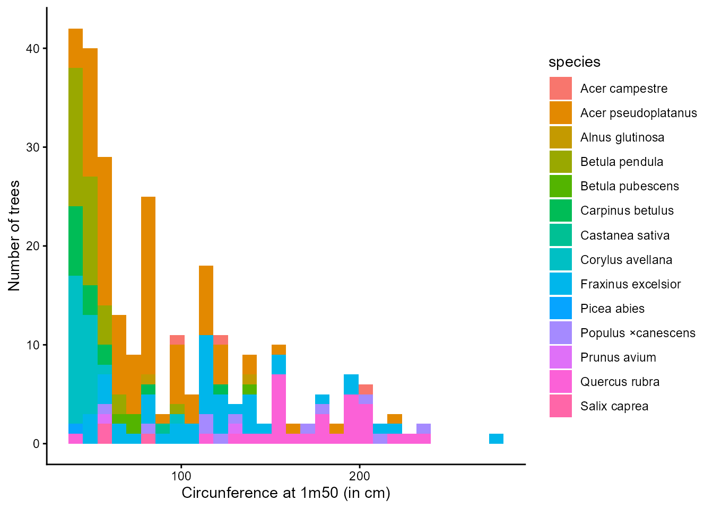
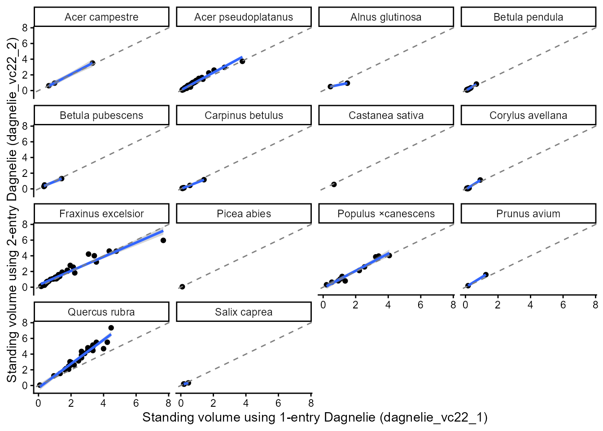

# Get started to GCubeR

This vignette provides a quick introduction to the main functionalities
of GCubeR using the example dataset included in the package,
[`GCubeR::data_rondeux`](https://gauthierligot.github.io/GCubeR/reference/data_rondeux.md).

``` r

data("data_rondeux")
```

The dataset comes from a mixed, uneven-aged stand in the Bois Jacques
Rondeux forest near Gembloux (Wallonia, Belgium). Tree diameters were
measured at 1.50 m above ground and converted to circumference (`c150`).
Total tree height was also measured, allowing the use of allometric
equations that require both circumference and height (e.g., the Dagnelie
two-entry equations).



## Dagnelie equations

Most allometric equations require circumference measured at 1.30 m above
ground (`c130`). Therefore, the first step is to convert `c150` into
`c130`. The
[`c150_c130()`](https://gauthierligot.github.io/GCubeR/reference/c150_c130.md)
function automatically performs this conversion when supplied with a
data frame containing the variables `c150` and the GCubeR species code.

``` r

data <- GCubeR::c150_c130(data_rondeux)
```

The Dagnelie one-entry equations estimate standing volume, (m3 per
tree), using only the circumference at 1.30 m (`c130`).

``` r

data <- GCubeR::dagnelie_vc22_1(data)
```

Because the dataset also includes total tree height, we can use the
Dagnelie two-entry equations, which estimate standing volume from both
circumference at 1.30 m (`c130`) and total tree height (`htot`).

``` r

data <- GCubeR::dagnelie_vc22_2(data)
```

The predictions obtained from the one-entry and two-entry equations can
then be compared.

For this dataset, the two-entry equations generally predict larger
standing volumes than the one-entry equations, particularly for Quercus
rubra. This difference likely reflects the fact that the inventories
trees are taller than the average trees used to calibrate the one-entry
equations, allowing the two-entry equations to better account for their
observed height.


