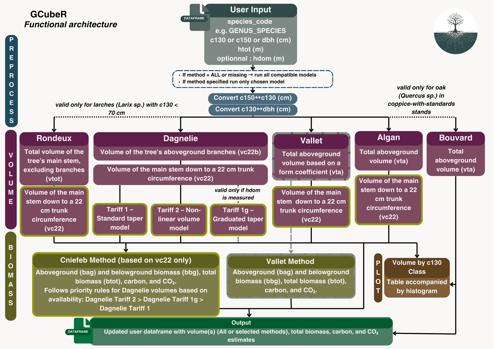

```{r setup, include = FALSE}
library(GCubeR)
library(dplyr)
library(knitr)
library(kableExtra)

knitr::opts_chunk$set(
  collapse = TRUE,
  comment = "#>",
  fig.align = "center",
  fig.width = 7,
  fig.height = 5,
  message = FALSE,
  warning = FALSE
)
gembloux_kable <- function(x, caption = NULL, digits = 3) {
  # nombre de colonnes du data.frame (à garder avant le pipe)
  last_col <- ncol(x)

  pal_dark   <- "#004B87"  # dark blue
  pal_light  <- "#e8f5e9"  # light green
  pal_accent <- "#2e7d32"  # mid green

  x %>%
    kable(format = "html", digits = digits, caption = caption) %>%
    kable_styling(
      full_width        = FALSE,
      bootstrap_options = c("striped", "hover", "condensed")
    ) %>%
    row_spec(0, background = pal_dark, color = "white", bold = TRUE) %>%
    column_spec(1, background = pal_light, bold = TRUE) %>%
    column_spec(last_col, background = pal_accent, color = "white", bold = TRUE)
}
```


# Welcome to GCubeR

Forest quantification has become increasingly important in recent years.
Whether your goal is to anticipate financial flows, estimate standing timber value,
or quantify the carbon stored in your forest, working with tree volume equations
is rarely straightforward. Formulas are often difficult to find, coefficients vary
between species, and implementations can be tedious or error-prone.

GCubeR provides a unified and user-friendly toolbox that brings together the
most commonly used allometric equations in forestry. With only a few input
variables, the package handles all calculations for you.

GCubeR includes implementations of Algan, Rondeux, Dagnelie, and Vallet
volume equations, as well as CNPF and Vallet's methods for estimating
biomass, carbon content, and CO₂ equivalent.

This vignette walks you through the workflow of applying GCubeR to your dataset
and shows how to extract the most useful information from your forest inventory.

---

# Global structure of GCubeR

```{r, echo=FALSE, out.width="100%", fig.align="center"}

```

## User input

To use **GCubeR**, the user must provide a data frame with at least:

- `c130`: stem circumference at 1.30 m height (cm)  
- `species_code`: full Latin species name in uppercase, e.g. \"QUERCUS_ROBUR\"

To be able to use **all** functions in the package, your data frame should contain:

- `c130`: stem circumference at 1.30 m height (cm)  
- `species_code`: species Latin name in uppercase (e.g. \"FAGUS_SYLVATICA\")  
- `hdom`: dominant height (m)  
- `htot`: total tree height (m)  
- `dbh`: diameter at breast height (cm)

---

# Converting module

GCubeR provides tools to transform basic measurements so they fit the requirements
of the different volume and biomass equations:

- **`c150_c130`** : converts stem circumference measured at 1.50 m (`c150`)
  to circumference at 1.30 m (`c130`)
- **`add_c130_dbh`** : converts circumference at 1.30 m (`c130`) to
  diameter at breast height (`dbh`), and can also back-calculate `c130`
  from dbh when needed

---

# VTA module

The **VTA module** computes total aboveground volume (trunk + branches) using
three different methods.

## Rondeux 2 entry method (parametric) - `rondeux_vc22_vtot()`

This equation is valid for trees with `c130` values between 10 and 70 cm.
It estimates both VTA and VC22, and was calibrated specifically for larch
(`LARIX_SP`) growing in the southern part of Belgium.

### Required column:

- `htot`
- `species_code`
- `c130`

### Available for :

- `LARIX_SP`

*validity range : c130 < 70*

### Formula:

vc22 :

\[
v_{\mathrm{c22}} =
a_{\mathrm{vc22}}
\;+\;
b_{\mathrm{vc22}} \, c_{130}^{2} \, h_{\mathrm{tot}}
\]

vta :

\[
v_{\mathrm{vta}} =
a_{\mathrm{vtot}} \, c_{130}^{2} \, h_{\mathrm{tot}}
\]

All coefficients used in this model are provided in the dataset `rondeux_vc22_vtot()`.  
You can load them with:

data("rondeux_vc22_vtot", package = "GCubeR")

### Example :

```{r, echo=TRUE, message=FALSE, warning=FALSE}

# Data creation
data <- data.frame(
  species_code = c("LARIX_SP","LARIX_SP","LARIX_SP","LARIX_SP"),
  htot = c(12,13,10,11),
  c130 = c(65,56,52,68)
)

# Computes volumes (function from package)
data <- rondeux_vc22_vtot(data)

```

#### Results :

```{r, echo=FALSE}
gembloux_kable(data)
```


---

## Bouvard method — `bouvard_vta()`

This equation applies specifically to oaks growing in coppice-with-standards systems.
It is based on simple geometric properties of the stem and was historically developed
to provide a quick and practical method for estimating tree volume in the field.

### Required columns:

- `dbh`
- `species_code`
- `htot`

### Available for `species_code` :

- `QUERCUS_SP`

### Formula :

\[
v_{\mathrm{vta}} = 0.5 \times \left(\frac{dbh}{100}\right)^2 \times h_{tot}
\]

`dbh` is in cm, `htot` in m, result in m³ per tree.

### Example :

```{r}
# Data creation
data <- data.frame(
  species_code = c("QUERCUS_SP","QUERCUS_SP","QUERCUS_SP","QUERCUS_SP"),
  htot = c(28,35,21,36),
  c130 = c(180,235,175,238)
)
# Adding dbh
data <- add_c130_dbh(data)

# Computes volumes
data <- bouvard_vta(data)

```

#### Results :

```{r, echo=FALSE}
gembloux_kable(data)
```

---

## Algan method — `algan_vta_vc22()`

The Algan method is a simplified volume estimator based on geometric properties of the stem,
with a correction factor applied to account for stem taper. This function computes both
VC22 and VTA and appends the results to the input data frame.

### Required columns:

- `dbh`
- `species_code`
- `htot`

### Available for `species_code` :

#### VTA :

- `ABIES_ALBA`

#### VC22 :

- `ABIES_ALBA`  
- `PICEA_ABIES`  
- `ALNUS_GLUTINOSA`  
- `PRUNUS_AVIUM`  
- `BETULA_SP`

*validity range : dbh > 15cm*

### Formula:

vta :

\[
v_{\mathrm{vta}} = 0.4 \times \left(\frac{dbh}{100}\right)^2 \times h_{tot}
\]

vc22 :

\[
v_{\mathrm{c22}} = 0.33 \, d_{\mathrm{bh}}^{2} \, h_{\mathrm{tot}}
\]


### Example :

```{r}
# Data creation
data <- data.frame(
  species_code = c("ABIES_ALBA","ABIES_ALBA","ABIES_ALBA","ABIES_ALBA"),
  htot = c(28,35,21,36),
  c130 = c(180,235,175,238)
)

# Adding dbh
data <- add_c130_dbh(data)

# Computes volumes
data <- algan_vta_vc22(data)

```

#### Results :

```{r, echo=FALSE}
gembloux_kable(data)
```

---

## Vallet method — `vallet_vta()`

This equation is derived from statistical regression models based on tree size parameters.
It was calibrated using a dataset that included relatively small-diameter trees, and therefore
predictions for very small trees should be interpreted with caution.

### Required columns:

- `c130`
- `species_code`
- `htot`

### Available for the following species:

- `PICEA_ABIES`  
- `QUERCUS_ROBUR`  
- `FAGUS_SYLVATICA`  
- `PINUS_SYLVESTRIS`  
- `PINUS_PINASTER`  
- `ABIES_ALBA`  
- `PSEUDOTSUGA_MENZIESII`  

*validity range : c130 > 45*

### Formula:

#### Form coeficcient term 1:
\[
\text{term}_{1,c}
= 
c \left( \frac{\sqrt{c_{130}}}{h_{\mathrm{tot}}} \right)
\]

#### Form coeficcient term 2:
\[
\text{term}_{2,d}
=
1 + \frac{d}{c_{130}^{2}}
\]

#### Form coeficcient:
\[
\mathrm{form}
=
\left( a + b\,c_{130} + \text{term}_{1,c} \right)
\;\times\;
\text{term}_{2,d}
\]

#### vta:
\[
v_{\mathrm{vta}} =
\mathrm{form} \times \frac{1}{\pi \cdot 40000} \times c_{130}^2 \times h_{tot}
\]

All coefficients used in this model are provided in the dataset `vallet_vta()`.  
You can load them with:

data("vallet_vta", package = "GCubeR")

### Example :

```{r}
# Data creation
data <- data.frame(
  species_code = c("ABIES_ALBA","QUERCUS_ROBUR","PINUS_PINASTER","ABIES_ALBA"),
  htot = c(28,35,21,36),
  c130 = c(180,235,175,238)
)

# Computes volumes
data <- vallet_vta(data)

```

#### Results :

```{r, echo=FALSE}
gembloux_kable(data)
```

---

# VC22 module

The **VC22 module** estimates stem volume up to the point where the circumference
reaches 22 cm, using several modelling approaches.

## Non-parametric equations

The non-parametric equations are derived from empirical volume tables. Because these
tables reflect locally observed growth patterns, they typically perform well for trees
growing under conditions similar to those used to construct the models.

In GCubeR, all non-parametric models are based on **Dagnelie’s equations**. These equations
are practical because they allow volume estimation for a wide range of tree species and
require only a small number of input variables.

- *The single-entry method* provides the simplest volume estimate and requires only `c130`.
- *The graduated single-entry method* improves accuracy in pure, even-aged stands by incorporating dominant height.
- *The two-entry method* is the most accurate, but it requires `htot`, which can be difficult to measure in large stands. It is therefore recommended primarily for high-value trees.

---

## Dagnelie single-entry method — `dagnelie_vc22_1()`

### Required columns:

- `c130`
- `species_code`

### Available for the following `species_code`:
<div style="display: flex; gap: 40px;">

<div style="flex: 1;">

- `ABIES_ALBA` 
- `ACER_CAMPESTRE` 
- `ACER_PLATANOIDES`
- `ACER_PSEUDOPLATANUS`
- `AESCULUS_HIPPOCASTANUM`
- `ALNUS_GLUTINOSA`
- `ALNUS_INCANA`
- `BETULA_SP`
- `CARPINUS_SP`
- `CASTANEA_SATIVA`
- `CORLYUS_AVELLANA`
- `CRATAEGUS_SP`
- `CUPRESSUS_SP`
- `FAGUS_SYLVATICA`
- `FRAXINUS_EXCELSIOR`
- `JUNGLANS_SP`
- `LARIX_SP`
- `MALUS_SP`
- `PICEA_ABIES`
- `PICEA_SITCHENSIS`
- `PINUS_LARICIO`
- `PINUS_NIGRA`
- `PINUS_SYLVESTRIS`

</div>

<div style="flex: 1;">


- `POPULUS_TREMULA`
- `POPULUSxCANADENSIS`
- `PRUNUS_AVIUM`
- `PRUNUS_CERASUS`
- `PRUNUS_SP`
- `PSEUDOTSUGA_MENZIESII`
- `PYRUS_SP`
- `QUERCUS_PETRAEA`
- `QUERCUS_PUBESCENS`
- `QUERCUS_ROBUR`
- `QUERCUS_RUBRA`
- `QUERCUS_SP`
- `RHAMNUS_FRANGULA`
- `ROBINIA_PSEUDOACACIA`
- `SALIX_SP`
- `SAMBUCUS_SP`
- `SORBUS_ARIA`
- `SORBUS_AUCUPARIA`
- `TAXUS_BACCATA`
- `THUJA_PLICATA`
- `TILIA_SP`
- `ULMUS_SP`

</div>

</div>

### Formula:

\[
v_{\mathrm{c22}} = 
a \;+\; b\,c_{130} \;+\; c\,c_{130}^2 \;+\; d\,c_{130}^3
\]


All coefficients and validity range used in this model are provided in the dataset `dan1`.  
You can load them with:

`data("dan1", package = "GCubeR")`

### Example :

```{r}
# Data creation
data <- data.frame(
  species_code = c("ABIES_ALBA","QUERCUS_ROBUR","PINUS_SYLVESTRIS","ABIES_ALBA"),
  htot = c(28,35,21,36),
  c130 = c(180,235,175,238)
)

# Computes volumes
data <- dagnelie_vc22_1(data)
```

#### Results :

```{r, echo=FALSE}
gembloux_kable(data)
```

---

## Graduated single-entry Dagnelie method — `dagnelie_vc22_1g()`

### Required columns:

- `c130`
- `species_code`
- `hdom`

### Available for the following `species_code`:

see at Dagnelie single entry method

### Formula:

\[
v_{\mathrm{c22}} =
a \;+\;
b\,c_{130} \;+\;
c\,c_{130}^{2} \;+\;
d\,c_{130}^{3} \;+\;
e\,h_{\mathrm{dom}} \;+\;
f\,h_{\mathrm{dom}}\,c_{130}^{2}
\]

All coefficients and validity range used in this model are provided in the dataset `dan1g`.  
You can load them with:

data("dan1g", package = "GCubeR")

### Example :

```{r}
# Data creation
data <- data.frame(
  species_code = c("ABIES_ALBA","QUERCUS_ROBUR","PINUS_SYLVESTRIS","ABIES_ALBA"),
  hdom = c(20,25,18,35),
  c130 = c(180,235,175,238)
)

# Computes volumes
data <- dagnelie_vc22_1g(data)

```

#### Results :

```{r, echo=FALSE}
gembloux_kable(data)
```

---

## Dagnelie two entry model - `dagnelie_vc22_2()`

### Required column:

- `c130`
- `species_code`
- `htot`

### Available for the folowing `species_code`:

See at Dagnelie single entry method

### Formula :

\[
v =
a \;+\;
b\,c_{130}
\;+\;
c\,c_{130}^{2}
\;+\;
d\,c_{130}^{3}
\;+\;
e\,h_{\mathrm{tot}}
\;+\;
f\,h_{\mathrm{tot}}\,c_{130}^{2}
\]


All coefficients and validity range used in this model are provided in the dataset `dan2`.  
You can load them with:

data("dan2", package = "GCubeR")

### Example :

```{r}
# Data creation
data <- data.frame(
  species_code = c("ABIES_ALBA","QUERCUS_ROBUR","PINUS_SYLVESTRIS","ABIES_ALBA"),
  htot = c(20,25,18,35),
  c130 = c(180,235,175,238)
)

# Computes volumes
data <- dagnelie_vc22_2(data)

```

#### Results :

```{r, echo=FALSE}
gembloux_kable(data)
```

---

*Parametric equations*

Parametric models provide stable and interpretable equations that remain valid
across a broad range of tree dimensions. Because they are based on geometric
parameters, they tend to perform well for trees with predictable stem shapes.

## Vallet 2 entry method - `vallet_vc22()`

The Vallet method relies on a geometrically adjusted model, with species-specific
coefficients calibrated to reflect the structural characteristics of each species
covered by the function.


### Required columns:

- `dbh`
- `species_code`
- `htot`

### Available for the folowing `species_code`:
<div style="display: flex; gap: 40px;">

<div style="flex: 1;">


- `QUERCUS_ROBUR`
- `QUERCUS_PETRAEA`
- `QUERCUS_PUBESCENS`
- `FAGUS_SYLVATICA`
- `PINUS_PINASTER`
- `PINUS_SYLVESTRIS`

</div>

<div style="flex: 1;">

- `PINUS_LARICIO`
- `PINUS_NIGRA`
- `PINUS_HALEPENSIS`
- `PICEA_ABIES`
- `ABIES_ALBA`
- `PSEUDOTSUGA_MENZIESII`

</div>

</div>

### Formula:

\[
\text{term}_{1,a} = a \times \left( \frac{h_{\mathrm{tot}}}{dbh} \right)
\]

\[
\text{term}_{2,bc} = b \;+\; c \, dbh
\]

\[
\text{term}_{3,\mathrm{geom}} =
\frac{\pi \, dbh^{2} \, h_{\mathrm{tot}}}{40}
\]

\[
v_{\mathrm{c22,dm3}} =
\text{term}_{1,a}
\;+\;
\text{term}_{2,bc} \times \text{term}_{3,\mathrm{geom}}
\]


All coefficients and validity range used in this model are provided in the dataset `vallet_vc22()`.  
You can load them with:

data("vallet_vc22", package = "GCubeR")

### Example :

```{r}
# Data creation
data <- data.frame(
  species_code = c("ABIES_ALBA","QUERCUS_ROBUR","PINUS_PINASTER","ABIES_ALBA"),
  htot = c(28,35,21,36),
  c130 = c(180,235,175,238)
)

# Adding dbh
data <- add_c130_dbh(data)

# Computes volumes
data <- vallet_vc22(data)
```

#### Results :

```{r, echo=FALSE}
gembloux_kable(data)
```

---

## Rondeux 2 entry method - `rondeux_vc22_vtot()`

This equation is only available for `c130` range between 10 and 70cm.
It computes both VTA **AND** VC22. Adapted only for Laryx species and in the
southern part of Belgium.

### Available for the folowing `species_code`:

- `LARIX_SP`

### Required column :

- `htot`
- `species_code`
- `c130`

### Formula :

\[
v_{\mathrm{c22}} =
a_{\mathrm{vc22}}
\;+\;
b_{\mathrm{vc22}} \, c_{130}^{2} \, h_{\mathrm{tot}}
\]

\[
v_{\mathrm{vta}} =
a_{\mathrm{vtot}} \, c_{130}^{2} \, h_{\mathrm{tot}}
\]

### Example :

```{r}
# Data creation
data <- data.frame(
  species_code = c("LARIX_SP","LARIX_SP","LARIX_SP","LARIX_SP"),
  htot = c(12,13,10,11),
  c130 = c(65,56,52,68)
)

# Computes volumes
data <- rondeux_vc22_vtot(data)

```

#### Results :

```{r, echo=FALSE}
gembloux_kable(data)
```

## Algan method — `algan_vta_vc22()`

The algan method is a simplified volume calculator made to calculate volumes. It's 
driven by geometrical properties of the stem with a correction factor. This function
computes both vc22 *and* vta and add it to your dataframe.

### Required columns:

- `dbh`
- `species_code`
- `htot`

### Available for the following `species_code`:

- `ABIES_ALBA`

### Formula:

vta :

\[
v_{\mathrm{vta}} = 0.4 \times \left(\frac{dbh}{100}\right)^2 \times h_{tot}
\]

vc22 :

\[
v_{\mathrm{c22}} = 0.33 \, d_{\mathrm{bh}}^{2} \, h_{\mathrm{tot}}
\]


### Example :

```{r}
# Data creation
data <- data.frame(
  species_code = c("ABIES_ALBA","ABIES_ALBA","ABIES_ALBA","ABIES_ALBA"),
  htot = c(28,35,21,36),
  c130 = c(180,235,175,238)
)

# Adding dbh
data <- add_c130_dbh(data)

# Computes volumes
data <- algan_vta_vc22(data)

```

#### Results :

```{r, echo=FALSE}
gembloux_kable(data)
```


---

# Biomass/carbon/CO\(_2\) storage module

Computes total biomass (aboveground + root), carbon content and CO2 equivalent
for tree species using CNPF (with multiple trunk volume sources) and Vallet methods.

## Biomass/carbon/CO\(_2\)calculator :`biomass_calc()`

This function include 2 several method:

### 1. CNPF method

CNPF (Compagnie Nationale des Ingenieurs et Experts Forestiers et des Experts Bois)
Computes the total biomass, carbon and CO2 content of trees (branches, roots and scorce included).
This method is computed automaticly for all vc22 included in the dataframe. If diffrent 
vc22 computed with dagnelies method are mentionned in the dataframe `biomass_calc()`
will prior the most precise method.

#### Required columns :

- `species_code`
- at least one *vc22* computed with the module above


#### Formula : 

##### Stem biomass (wood + bark)

The above-ground stem biomass, \(B_{\mathrm{Ag}}\) (bag), is computed from  
the stem volume \(v_{c22}\), the bark factor \(F_{\mathrm{eb}}\), and wood density \(\rho\):

\[
B_{\mathrm{Ag}} = v_{c22} \times F_{\mathrm{eb}} \times \rho
\]

##### Branch biomass

The branch biomass, \(B_{\mathrm{Bg}}\) (bbg), is estimated using an allometric exponential model:

\[
B_{\mathrm{Bg}} =
\exp\left(
-1.0587
\;+\;
0.8836 \, \ln(B_{\mathrm{Ag}})
\;+\;
0.2840
\right)
\]

##### Total above-ground biomass

The total above-ground biomass, \(B_{\mathrm{Tot}}\) (btot), is:

\[
B_{\mathrm{Tot}} = B_{\mathrm{Ag}} + B_{\mathrm{Bg}}
\]

##### Carbon contained in the biomass

\[
C = B_{\mathrm{Tot}} \times 0.475
\]

##### Conversion carbon → CO\(_2\)

\[
CO_{2} = C \times \frac{44}{12}
\]


All coefficients used in this model are provided in the dataset `biomass_calc()`.  
You can load them with:

data("density_table", package = "GCubeR")

#### Example :

```{r}
# Data creation
data <- data.frame(
  species_code = c("ABIES_ALBA","QUERCUS_ROBUR","PINUS_SYLVESTRIS","ABIES_ALBA"),
  htot = c(20,25,18,35),
  c130 = c(180,235,175,238)
)

# Computes volumes
data <- dagnelie_vc22_2(data)

# Computes biomass
data <- biomass_calc(data)

```

##### Results :

```{r, echo=FALSE}
scroll_box(
  gembloux_kable(data),
  width = "100%",
  height = "200px"
)
```

### 2. Vallet method

Based on statistical regression on parameter taken on even aged stand (parametric equation) 
this method is widely used to evaluate biomass and validated for trees in sylvicultural
and ecological situation. This method is automaticly applied to the `vallet_vta` entry.

#### Required columns :

- `species_code`
- `vallet_vta`

#### Formula :

##### Stem biomass (wood + bark)

\[
B_{\mathrm{Ag}} = B_{\mathrm{stem}} = v_{\mathrm{vta}} \times \rho
\]

where \(v_{\mathrm{vta}}\) is the total tree volume (`vallet_vta`) and \(\rho\) is the wood density.

##### Branch biomass

\[
B_{\mathrm{Bg}} = \exp\Big(
-1.0587 + 0.8836 \cdot \ln(B_{\mathrm{Ag}}) + 0.2840
\Big)
\]

##### Total above-ground biomass

\[
B_{\mathrm{Tot}} = B_{\mathrm{Ag}} + B_{\mathrm{Bg}}
\]

##### Carbon contained in the biomass

\[
C = B_{\mathrm{Tot}} \times 0.475
\]

##### Conversion carbon → CO\(_2\)

\[
CO_2 = C \times \frac{44}{12}
\]


All coefficients used in this model are provided in the dataset `biomass_calc()`.  
You can load them with:

data("density_table", package = "GCubeR")

#### Example : 

```{r}
# Data creation
data <- data.frame(
  species_code = c("ABIES_ALBA","QUERCUS_ROBUR","PINUS_SYLVESTRIS","ABIES_ALBA"),
  htot = c(20,25,18,35),
  c130 = c(180,235,175,238)
)

# Computes volumes
data <- vallet_vta(data)

# Computes biomass
data <- biomass_calc(data)

```

##### Result:

```{r, echo=FALSE}
gembloux_kable(data)
```

# Data exportation functionality

## ouput usage

For each function above a parameter named `output` can be filled by a file path to write a csv containing all the data available in the dataframe.

### Example : 

```{r}
# Data creation
data <- data.frame(
  species_code = c("ABIES_ALBA","QUERCUS_ROBUR","PINUS_SYLVESTRIS","ABIES_ALBA"),
  c130 = c(180,235,175,238)
)

# Type of path needed
filepath <- "file/path/example.csv"
```
```{r, echo=FALSE}
# For the example (do not run)
filepath <- tempfile(fileext = ".csv")
```
```{r, message=FALSE}
# Computes volumes and export csv
data <- dagnelie_vc22_1(data, output= filepath)

```

#### Result:

```{r, echo=FALSE}
gembloux_kable(data)
```

## Plot and output module - `plot_by_class()`

This function allows you to automaticly create a histogram plot with c130 classes
for x and volume for the y. If an output is mentionned a csv is written following the 
file path. In lines you have the several c130 classes in column the different species
code and a total and all the volume per species per class in cells.

### Example :

```{r, echo=FALSE}
set.seed(123)  # reproductible

n <- 150

# c130 entre 50 et 200
c130 <- runif(n, min = 50, max = 200)

# hauteur proportionnelle (ex: htot ≈ 0.25 * c130 + bruit aléatoire)
htot <- 0.25 * c130 + rnorm(n, mean = 0, sd = 3)

# bornes réalistes (hauteur min 5 m, max 45 m)
htot <- pmax(5, pmin(htot, 45))

# quelques espèces possibles
species_list <- c(
  "PINUS_SYLVESTRIS", "PICEA_ABIES", "QUERCUS_ROBUR",
  "FAGUS_SYLVATICA", "BETULA_SP"
)

species_code <- sample(species_list, n, replace = TRUE)

# construction
df <- data.frame(
  c130 = round(c130, 1),
  htot = round(htot, 1),
  species_code = species_code
)
```
```{r, echo=TRUE}
filepath <- "my/file/path.csv"
```
```{r, echo=FALSE}
# For the example
filepath <- tempfile(fileext = ".csv")

# Calcul des volumes
data <- dagnelie_vc22_1(df)
```
```{r, echo=TRUE, message=FALSE, warning=FALSE, fig.width=6, fig.height=6, fig.align="center"}
# Plot + export CSV
res <- plot_by_class(data, volume_col = "dagnelie_vc22_1",
                    output = filepath)

# Affichage du plot (important !)
res$plot
```
```{r, echo=FALSE}
# read the exported csv
csv_data <- read.csv2(filepath)

# display it with gembloux style
gembloux_kable(csv_data, caption = "CSV Output Preview")
```


