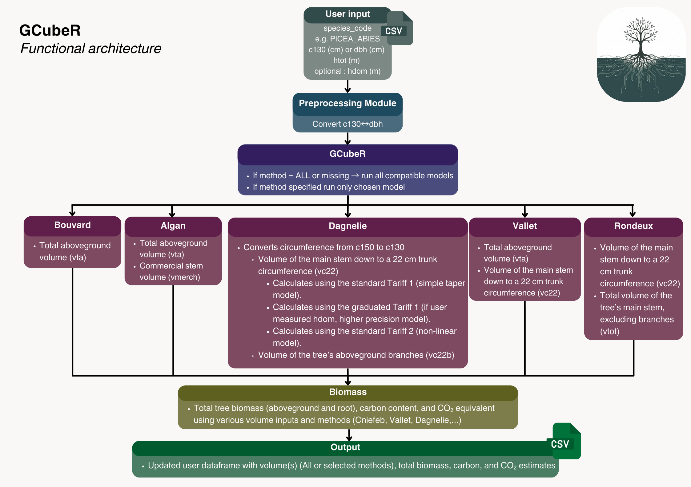

```{r setup, include = FALSE}
knitr::opts_chunk$set(
  collapse = TRUE,
  comment = "#>"
)

```
# Welcome to GCubeR

Forest quantification has become increasingly important in recent years.
Whether your goal is to anticipate financial flows, estimate standing timber value,
or quantify the carbon stored in your forest, working with tree volume equations
is rarely straightforward. Formulas are often difficult to find, coefficients vary
between species, and implementations can be tedious or error-prone.

GCubeR provides a unified and user-friendly toolbox that brings together the
most commonly used allometric equations in forestry. With only a few input
variables, the package handles all calculations for you.

GCubeR includes implementations of Algan, Rondeux, Dagnelie, and Vallet
volume equations, as well as CNIEFEB and Vallet's methods for estimating
biomass, carbon content, and CO₂ equivalent.

This vignette walks you through the workflow of applying GCubeR to your dataset
and shows how to extract the most useful information from your forest inventory.

---

# Global structure of GCubeR

## User input

To use **GCubeR**, the user must provide a data frame with at least:

- `c130`: stem circumference at 1.30 m height (cm)  
- `species_code`: full Latin species name in uppercase, e.g. `"QUERCUS_ROBUR"`

To be able to use **all** functions in the package, your data frame should contain:

- `c130`: stem circumference at 1.30 m height (cm)  
- `species_code`: species Latin name in uppercase (e.g. `"FAGUS_SYLVATICA"`)  
- `hdom`: dominant height (m)  
- `htot`: total tree height (m)  
- `dbh`: diameter at breast height (cm)

---

# Converting module

GCubeR provides tools to transform basic measurements so they fit the requirements
of the different volume and biomass equations:

- **`c150_c130`** : converts stem circumference measured at 1.50 m (`c150`)
  to circumference at 1.30 m (`c130`)
- **`add_c130_dbh`** : converts circumference at 1.30 m (`c130`) to
  diameter at breast height (`dbh`), and can also back-calculate `c130`
  from `dbh` when needed

---

# VTA module

The **VTA module** computes total aboveground volume (trunk + branches) using
three different methods.

### Bouvard method — `bouvard_vta`

Available for **QUERCUS** species.

Formula:

\[
v_{\mathrm{vta}} = 0.5 \times \left(\frac{dbh}{100}\right)^2 \times h_{tot}
\]

`dbh` is in cm, `htot` in m, result in m³ per tree.

---

### Algan method — `algan_vta_vc22`

Available for:

- `ABIES_ALBA`

Formula:

\[
v_{\mathrm{vta}} = 0.4 \times \left(\frac{dbh}{100}\right)^2 \times h_{tot}
\]

---

### Vallet method — `vallet_vta`

Available for the following species:

- `PICEA_ABIES`  
- `QUERCUS_ROBUR`  
- `FAGUS_SYLVATICA`  
- `PINUS_SYLVESTRIS`  
- `PINUS_PINASTER`  
- `ABIES_ALBA`  
- `PSEUDOTSUGA_MENZIESII`  

Formula:

\[
v_{\mathrm{vta}} =
\mathrm{form} \times \frac{1}{\pi \cdot 40000} \times c_{130}^2 \times h_{tot}
\]

where the *form factor* is species-specific and computed internally from
Vallet’s coefficients.

```{r c150_c130-example}
GCubeR::c150_c130(data.frame(
  c130 = 130,
  species_code = "QUERCUS_ROBUR",
  htot = 25
))
```
```{r add_c130_dbh-example}
GCubeR::add_c130_dbh(data.frame(
  c130 = 130,
  species_code = "QUERCUS_ROBUR",
  htot = 25
))
```
```{r vallet_vc22-example}
GCubeR::vallet_vc22(data.frame(
  dbh = 45,
  species_code = "QUERCUS_ROBUR",
  htot = 25
))
```
```{r vallet_vta-example}
GCubeR::vallet_vta(data.frame(
  c130 = 130,
  species_code = "QUERCUS_ROBUR",
  htot = 25
))
```
```{r dganelie_br-example}
GCubeR::dagnelie_br(data.frame(
  c130 = 130,
  species_code = "PINUS_SYLVESTRIS",
  hdom = 25
))
```
```{r dganelie_vc22_1-example}
GCubeR::dagnelie_vc22_1(data.frame(
  c130 = 130,
  species_code = "PINUS_SYLVESTRIS",
  hdom = 25
))
```
```{r dagnelie_vc22_1g-example}
GCubeR::dagnelie_vc22_1g(data.frame(
  c130 = 130,
  species_code = "PINUS_SYLVESTRIS",
  hdom = 25
))
```
```{r dagnelie_vc22_2-example}
GCubeR::dagnelie_vc22_2(data.frame(
  c130 = 130,
  species_code = "PINUS_SYLVESTRIS",
  htot = 25
))
```
```{r rondeux-example}
GCubeR::rondeux_vc22_vtot(data.frame(
  c130 = 65,
  species_code = "LARIX_DECIDUA",
  htot = 15
))
```
```{r bouvard-example}
GCubeR::bouvard_vta(data.frame(
  dbh = 45,
  species_code = "QUERCUS_SP",
  htot = 25
))
```
```{r algan-example}
GCubeR::algan_vta_vc22(data.frame(
  dbh = 45,
  species_code = "QUERCUS_ROBUR",
  htot = 25
))
```
```{r biomass-example}
GCubeR::biomass_calc(data.frame(
  vallet_vc22 = 1.3,
  species_code = "QUERCUS_ROBUR",
  htot = 25
))
```
```{r plotage-example}
GCubeR::volume_by_class(data.frame(
  c130 = c(145, 156, 234, 233),
  dagnelie_vc22_2         = c(2.5, 2.3, 4.5, 3.4),
  species_code = c("PINUS_SYLVESTRIS", "QUERCUS_RUBRA",
                    "QUERCUS_SP", "FAGUS_SYLVATICA")
 ))
 
```
---

# Function overview diagram

```{r function-diagram, echo=FALSE, fig.align='center', out.width='100%'}



