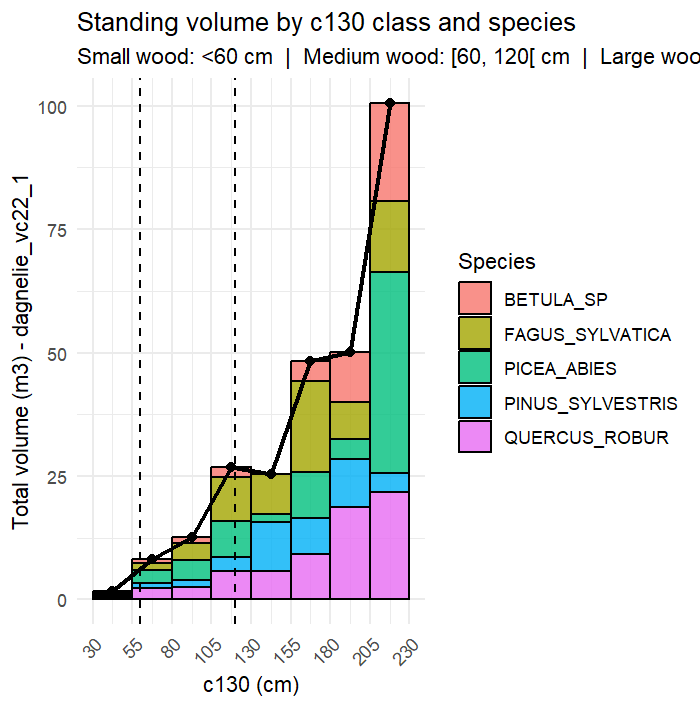

```{r, include = FALSE}
knitr::opts_chunk$set(
  collapse = TRUE,
  comment = "#>"
)
```

```{r setup}
```
<div style="
  display:flex;
  align-items:center;
  gap:15px;
  margin-bottom:20px;
  padding:15px 20px;
  background-color:#1e3a5f;   /* bleu foncé */
  color:white;                 /* texte blanc */
  border-radius:8px;           /* optionnel : angles arrondis */
">

  <!-- Logo rond -->
  

  <!-- Titre -->
  <h1 style="margin:0; font-size:28px; font-weight:700; color:white;">
    GCubeR – Implementation
  </h1>

</div>


<style>
table {
  border-collapse: collapse;
  width: 100%;
  font-size: 14px;
}

/* En-têtes du tableau (ligne de titres) */
th {
  background-color: #1e3a5f;  /* bleu foncé */
  color: white;
  padding: 8px;
  text-align: left;
  font-weight: bold;
}

/* Corps de tableau */
td {
  padding: 8px;
  vertical-align: top;
}

/* Zébrures : seulement sur les lignes qui NE sont PAS des section-header */
tbody tr:not(.section-header):nth-child(even) td {
  background-color: #e6eff9;  /* bleu très clair */
}

tbody tr:not(.section-header):nth-child(odd) td {
  background-color: #ffffff;  /* blanc */
}

/* Hover optionnel (surlignage au passage de la souris) */
tbody tr:not(.section-header):hover td {
  background-color: #d4e4f7;
}

/* Lignes de section (headers de bloc) */
.section-header td {
  background-color: #2E7D32;   /* orange très pâle */
  color: white;
  text-align: center;
  border: 4px solid transparent;
}
</style>


<table>
  <thead>
    <tr>
      <th>Function</th>
      <th>Method </th>
      <th>Outputs</th>
      <th>   Inputs</th>
      <th>Main formula (generic form)</th>
      <th>Notes / Context</th>
    </tr>
  </thead>
   <!-- input -->
    <tbody>
    <tr class="section-header">
      <td colspan="6">Converting module</td>
    </tr>
    <tr>
      <td><code>c150_c130()</code></td>
      <td>Convert <code>c150</code> to <code>c130</code> or<br>Convert <code>c130</code> to <code>c150</code><br></td>
      <td><code>c150</code><br><code>c130</code></td>
      <td><code>c130</code><br><code>c150</code></td>
      <td><code>c130=a⋅c150+b</code><br><code>c150=(c130-b)/a</code></td>
      <td>The function computes <code>c150</code> or <code>c130</code> depending on data availabity</td>
    </tr>
    <tr>
    <td><code>add_c130_dbh()</code></td>
  
    <td>Add or compute <code>c130</code> and <code>dbh</code>
      </td>
  
    <td><code>c130</code><br><code>dbh</code></td>
  
    <td>
      <code>dbh</code><br>
      <code>c130</code>
    </td> 
  
    <td>
     <code>dbh = c130 / π</code><br>
     <code>c130 = dbh · π</code>
    </td>
  
    <td>
    Auto-fills missing <code>c130</code> or <code>dbh</code>.<br>
    </td>
    </tr>
    </tbody>

  
    <!-- Dagnelie tariffs -->
    <tbody>
    <tr class="section-header">
      <td colspan="6">General & widely applicable volume models</td>
    </tr>
    <tr>
      <td><code>dagnelie_vc22_1()</code></td>
      <td>Dagnelie single entry</td>
      <td><code>vc22</code></td>
      <td><code>c130</code></td>
      <td><code>vc22 = a + b·c130 + c·c130² + d·c130³</code></td>
      <td>Simplest Dagnelie taper model, relies only on circumference.</td>
    </tr>

    <tr>
      <td><code>dagnelie_vc22_1g()</code></td>
      <td>Dagnelie graduaded</td>
      <td><code>vc22</code></td>
      <td><code>c130</code> <br> <code>hdom</code></td>
      <td><code>vc22 = a + b·c130 + c·c130² + d·c130³ + e·hdom + f·c130²·hdom</code></td>
      <td>Improves accuracy in pure, even-aged stands by adding dominant height.</td>
    </tr>

    <tr>
      <td><code>dagnelie_vc22_2()</code></td>
      <td>Dagnelie 2 entry</td>
      <td><code>vc22</code></td>
      <td><code>c130</code> <br> <code>htot</code></td>
      <td><code>vc22 = a + b·c130 + c·c130² + d·c130³ + e·htot + f·c130²·htot</code></td>
      <td>Most precise Dagnelie model; recommended mainly for high-value trees due to height measurement cost.</td>
    </tr>

    <tr>
      <td><code>dagnelie_br()</code></td>
      <td>Dagnelie – Branch volume</td>
      <td><code>vbr</code></td>
      <td><code>c130</code></td>
      <td><code>vbr = a + b·c130 + c·c130² + d·c130³</code></td>
      <td>Estimates branch volume from circumference only.</td>
    </tr>

    <!-- Vallet et al. -->
    <tr>
      <td><code>vallet_vta()</code></td>
      <td>Vallet - Volume above ground</td>
      <td><code>vta</code></td>
      <td><code>c130</code> <br> <code>htot</code></td>
      <td>
        <code>*form* = (a + b·c130 + c·c130/htot)·(1 + d·c130²)</code><br>
        <code>*vta* = form · (π / 40000) · c130² · htot</code>
      </td>
      <td>Explicitly models stem form factor; primarily for French species.</td>
    </tr>

    <tr>
      <td><code>vallet_vc22()</code></td>
      <td>Vallet merchantising volume</td>
      <td><code>vc22</code></td>
      <td><code>dbh</code> <br> <code>htot</code></td>
      <td><code>vc22 = a·htot/dbh + (b + c·dbh)·π·dbh²·htot / 40000</code></td>
      <td>Geometrically adjusted; species-specific coefficients reflecting stem structure.</td>
    </tr>
    </tbody>
    <tbody>
    <!-- Context-specific methods -->
    <tr class="section-header">
      <td colspan="6">Context-specific methods</td>
    </tr>
    <tr>
      <td><code>algan_vta_vc22()</code></td>
      <td>Algan - volume computer(2006)</td>
      <td>
        <code>vta</code><br>
        <code>vc22</code>
      </td>
      <td><code>dbh</code><br> <code>htot</code></td>
      <td>
        <code>vta = 0.40 · (dbh/100)² · htot</code><br>
        <code>vc22 = 0.33 · (dbh/100)² · htot</code>
      </td>
      <td>Simplified geometric estimator; mainly used in France for <em>Abies alba</em>.</td>
    </tr>

    <tr>
      <td><code>bouvard_vta()</code></td>
      <td>Bouvard - Volume above ground</td>
      <td><code>vta</code></td>
      <td><code>dbh</code><br><code>htot</code></td>
      <td><code>vta = 0.50 · (dbh/100)² · htot</code></td>
      <td>Specific to oaks (<em>Quercus</em> sp.), especially in coppice-with-standards regimes.</td>
    </tr>

    <tr>
      <td><code>rondeux_vc22_vtot()</code></td>
      <td>Rondeux / Pauwels et al. (2022)</td>
      <td>
        <code>vtot</code><br>
        <code>vc22</code>
      </td>
      <td><code>c130</code><br><code>htot</code></td>
      <td>
        <code>vtot = a · c130² · htot</code> <br>
        <code>vc22 = a + b · c130² · htot</code>
      </td>
      <td>Wallonia-specific; calibrated for larch (<em>Larix</em> sp.) in small-circumference trees (first thinnings).</td>
    </tr>
    </tbody>
    <tbody>
    <!-- Biomass / carbon -->
    <tr class="section-header">
      <td colspan="6">Biomass / carbon computer</td>
    </tr>
    
    <tr>
      <td><code>biomass_calc()</code> – CNPF pathway</td>
      <td>CNPF / France Valley</td>
      <td>
        <code>bag</code><br>
        <code>bbg</code><br>
        <code>btot</code><br>
        <code>carbon</code><br>
        <code>CO₂</code>
      </td>
      <td>
        <code>vc22</code><br>
      </td>
      <td>
        <code>bag = vc22 · feb · density</code><br>
        <code>bbg = exp(−a + b·ln(bag) + c)</code><br>
        <code>btot = bag + bbg</code><br>
        <code>C = 0.475 · btot</code>
      </td>
      <td>
        <code>feb = 1.30</code> (conifers)<br> <code>feb = 1.56</code> (broadleaves)<br> carbon and CO₂ derived from total biomass.
      </td>
    </tr>

    <tr>
      <td><code>biomass_calc()</code> – Vallet pathway</td>
      <td>Follow Vallet et al. (2006)</td>
      <td>
        <code>bag</code><br>
        <code>bbg</code><br>
        <code>btot</code><br>
        <code>carbon</code><br>
        <code>CO₂</code>
      </td>
      <td>
        <code>vallet_vta</code><br>
      </td>
      <td>
        <code>bag = vta · density</code><br>
        <code>bbg = exp(−a + b·ln(bag) + c)</code><br>
        <code>btot = bag + bbg</code>
      </td>
      <td>Used when <code>vallet_vta</code> is available<br> root biomass is implicitly included.</td>
    </tr>
    </tbody>
    <tbody>
    <tr class="section-header">
      <td colspan="6">Plot module</td>
    </tr>
    <tr>
      <td><code>plot_by_class()</code></td>
      <td>Plot histogram by class of <code>c130</code></td>
      <td><code>vc22</code><br><code>vta</code><br><code>btot</code><br></td>
      <td></td>
      <td></td>
      <td>Class width can be adjusted by the breaks input in the function</td>
    </tr>
    </tbody>

    </table>
